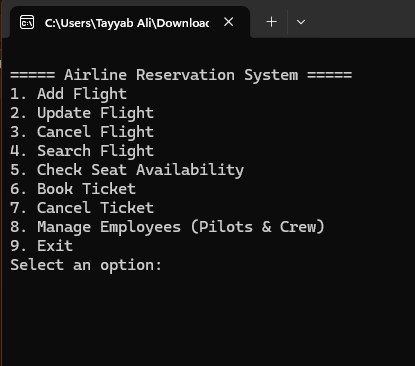

# Airline Reservation System

A professional console-based airline reservation application built in C# using .NET Framework 4.7.2. The system allows users to manage flights, book and cancel tickets, and maintain employee records through a simple menu-driven interface.

## Project Overview

This project demonstrates a basic airline management workflow with core reservation features, including:

- Flight creation, update, and cancellation
- Flight search and seat availability checks
- Ticket booking and cancellation
- Employee management for pilots and crew
- Console-based user interaction

## Features

- Manage airline flights with flight number, origin, destination, and seat data
- Book tickets for passengers with ticket number, seat number, and price
- Cancel existing tickets when needed
- Store and manage employee information such as ID, name, contact, email, DOB, and salary
- Use a simple terminal interface for all operations

### Console Interface

## Project Structure

- Program.cs - Main menu and system flow
- Flight.cs - Flight management logic
- Ticket.cs - Ticket booking and cancellation logic
- Employee.cs - Employee data management
- Passenger.cs - Passenger details
- Seat.cs - Seat-related operations
- Airline.cs / Airplane.cs - Airline and aircraft information

## Technologies Used

- C#
- .NET Framework 4.7.2
- Visual Studio / MSBuild

## How to Run

1. Open the solution file in Visual Studio.
2. Build the solution.
3. Run the application.
4. Use the menu to add flights, book tickets, and manage employees.

## Notes

This is a console-based academic/project-style application and is ideal for learning object-oriented programming concepts such as classes, lists, encapsulation, and basic console input/output.

## Future Improvements

- Add persistent database storage
- Implement a graphical user interface
- Add authentication and role-based access
- Improve seat availability and booking validation
